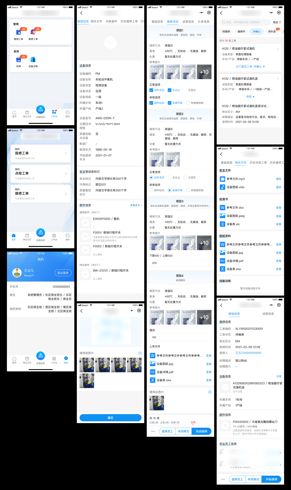

# 落魄前端在线求职

| 啥  |  都 |能 | 干  |
| ------------ | ------------ | ------------ | ------------: |
|  设 |   |   | 接 |
|  计 |   |   | 娃 |
|  开 |   |   | 跑 |
|  发 |   |   | 腿 |
|  测 |   |   | 陪 |
|  试 |   |   | 练 |

## 工具组件演示（阉割版本，实际项目中更完善）

- [移动端全景](https://531431988.github.io/project-demo/krpano/dist/) 可交互的全景展示，内部项目湖北交投上线
- [图片标注工具](https://531431988.github.io/project-demo/img-editor/) 基于图片的编辑工具
- [全景标注工具](https://531431988.github.io/project-demo/three-viewer/) 基于three的全景标注工具
- [自定义表单工具](https://531431988.github.io/vue-form-creation/dist/) 18年农业项目自定义表单工具（支持无限嵌套）
- [组件库](https://531431988.github.io/vue-component-library/dist/index.html#/) 18年后续因某些原因暂停了
- [openlayers组件](https://531431988.github.io/project-demo/vue-openlayers/) 18年接触GIS项目时简易封装的openlayers组件用与各项目开发（现在看来很烂）在未知的领域也能快速上手投入项目
- [简易流程图](https://531431988.github.io/project-demo/flow-chart/dist) 东风惠州本田项目封装的流程图工具

## 数据可视化

- [智慧校园数据可视化](https://531431988.github.io/project-demo/smart-campus/) 23年 独立的UI设计+前端开发配合unity工程师完成模型交互
- [广东社会心理服务体系监控](https://531431988.github.io/GDPSM/index) 19年设计开发
- [棉花统计](https://531431988.github.io/cotton/dist/data-analysis) admin/admin
- [一体化监控平台](https://531431988.github.io/DGJ-NMPS/index) 19年

## 管理后台（非常多就不列举）

- [某棉花管理平台](https://531431988.github.io/cotton/dist/) 19年开发内部系统，拆分基础演示  admin/admin
- 黄石一套表平台 内部项目涉及核心业务不过多展示

## 小程序（APP）

- 中钢安环院-已经上线可在小程序中搜索（内部应用需要登录使用，所以只能放部分设计界面），独立设计+开发，实际实现与设计有部分差异UI未做同步更新

- 设备管理（小程序、APP）内部应用需要帐号，以截图演示

- 还有其他小程序在开发中不便展示，后续更新
