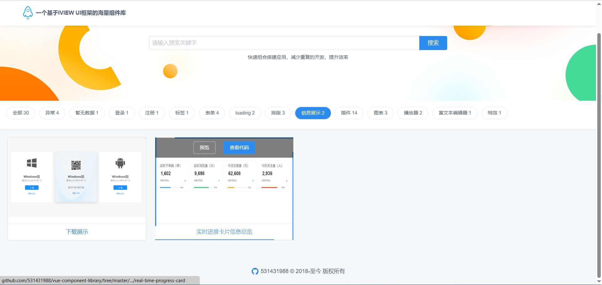
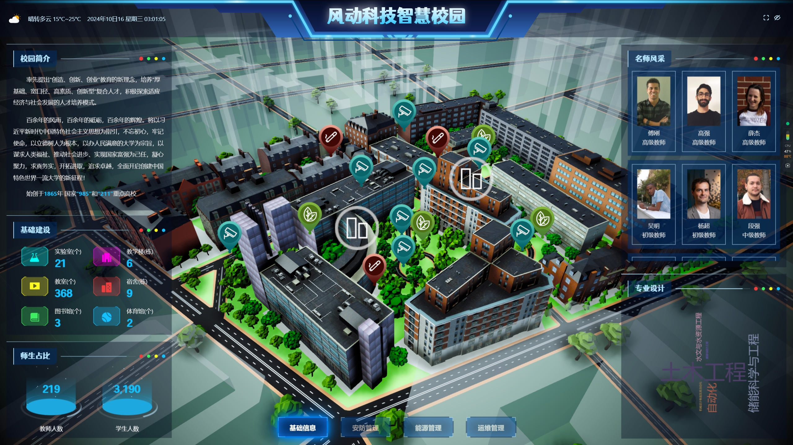

# 落魄前端在线求职

| 啥  |  都 |能 | 干  |
| ------------ | ------------ | ------------ | ------------: |
|  设 |   |   | 接 |
|  计 |   |   | 娃 |
|  开 |   |   | 跑 |
|  发 |   |   | 腿 |
|  测 |   |   | 陪 |
|  试 |   |   | 练 |

## 工具组件演示（阉割版本，实际项目中更完善）

- [移动端全景](https://531431988.github.io/project-demo/krpano/dist/) 可交互的全景展示，内部项目湖北交投上线
 

- [图片标注工具](https://531431988.github.io/project-demo/img-editor/) 基于图片的编辑工具
 

- [全景标注工具](https://531431988.github.io/project-demo/three-viewer/) 基于three的全景标注工具
 

- [自定义表单工具](https://531431988.github.io/vue-form-creation/dist/) 18年农业项目自定义表单工具（支持无限嵌套）

 

- [组件库](https://531431988.github.io/vue-component-library/dist/index.html#/) 18年后续因某些原因暂停了
 

- [openlayers组件](https://531431988.github.io/project-demo/vue-openlayers/) 18年接触GIS项目时简易封装的openlayers组件用与各项目开发（现在看来很烂）在未知的领域也能快速上手投入项目
 

- [简易流程图](https://531431988.github.io/project-demo/flow-chart/dist) 东风惠州本田项目封装的流程图工具
 

## 数据可视化

- [智慧校园数据可视化](https://531431988.github.io/project-demo/smart-campus/) 23年 独立的UI设计+前端开发配合unity工程师完成模型交互（模型较大受github影响加载非常慢）
 

<video width="300">
<source src="smart-campus/Tab-531431988.github.io_project-demo_smart-campus_.mp4" />
</video>

- [东风惠州本田智慧园区](https://531431988.github.io/project-demo/db-smart-park/) 东风惠州本田智慧园区基于微前端架构集成三方应用：捷顺门禁、大华摄像头、三方数据采集等功能，智慧园区为其中一小模块抽离出的3D演示（非正式效果）
 

- [广东社会心理服务体系监控](https://531431988.github.io/GDPSM/index) 19年设计开发
 

- [棉花统计](https://531431988.github.io/cotton/dist/#/data-analysis) admin/admin
 

- [一体化监控平台](https://531431988.github.io/DGJ-NMPS/index) 19年
 

## 管理后台（非常多就不列举）

- [某棉花管理平台](https://531431988.github.io/cotton/dist/) 19年开发内部系统，拆分基础演示  admin/admin
 

- 黄石一套表平台 内部项目涉及核心业务不过多展示
 

## 小程序（APP）

- 中钢安环院-已经上线可在小程序中搜索（内部应用需要登录使用，所以只能放部分设计界面），独立设计+开发，实际实现与设计有部分差异UI未做同步更新

- 设备管理（小程序、APP）内部应用需要帐号，以截图演示

- 还有其他小程序在开发中不便展示，后续更新
